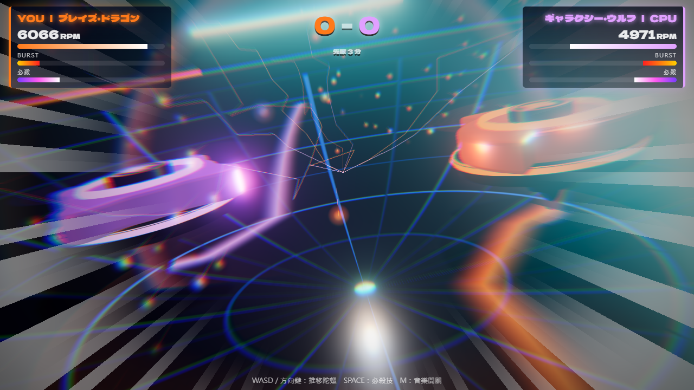
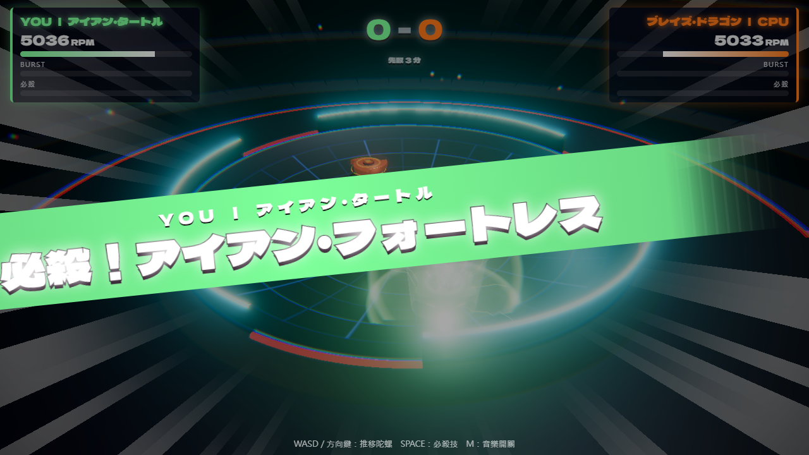
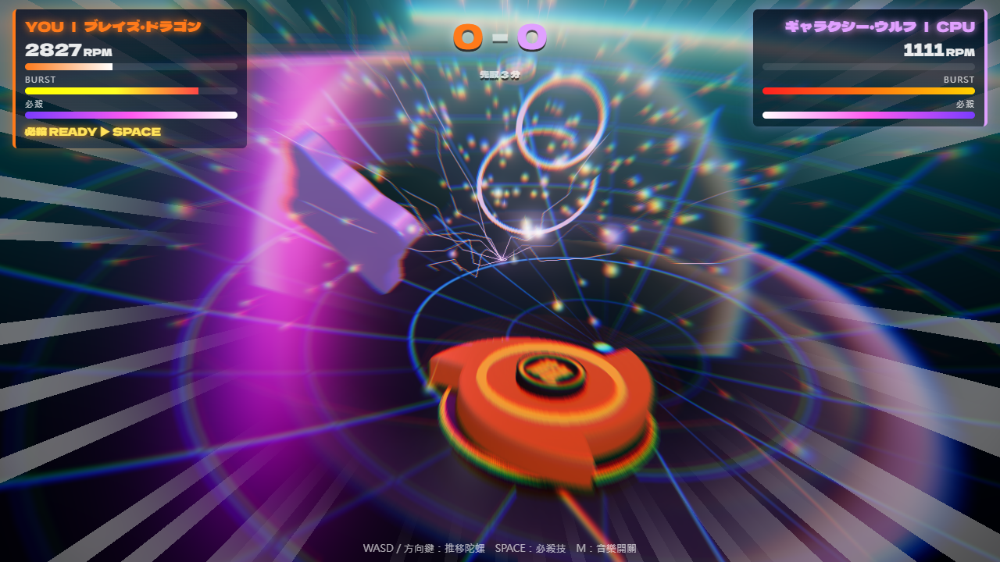
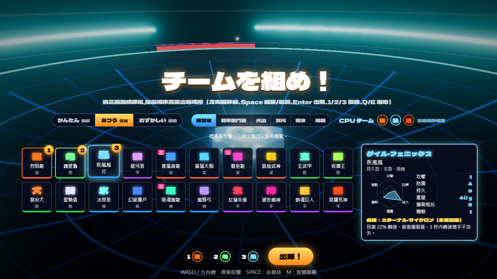
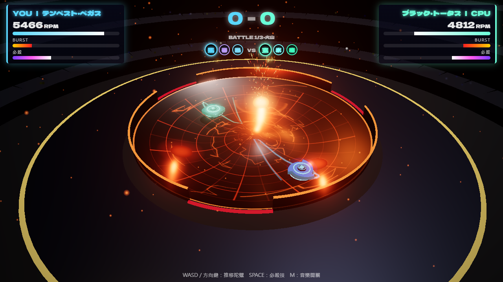
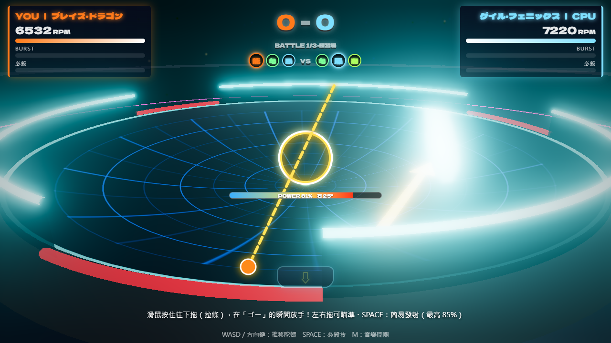

# Battle Tops（戰鬥陀螺）

瀏覽器上的 3D 戰鬥陀螺對戰遊戲，可以 1P 對 CPU，也可以用房號找朋友線上對戰。正宗 3 對 3 賽制：雙方各挑三顆依序對戰，三戰總分高者獲勝。
20 顆陀螺（4 顆原創＋16 顆致敬歷代名作），外觀參考原型的配色與輪廓，能力由六項基本屬性推導；組隊時可以換重心盤與軸心調整屬性。6 個場地（練習場、標準戰鬥盤、雙層戰鬥盤、火山、冰川、積水；兩個戰鬥盤照實體比賽盤做，撞進中間寬口是 3 分的極限終結），場地機關會實際改變陀螺走向；用拉發射台（滑鼠拖曳／手指滑動）發射。
標題畫面是模式選單：電腦對戰（3 對 3）、試驗模式（一對一比較陀螺與零件的搭配）、線上對戰、操作教學；右上角可以切換日文版（日式熱血風格、日語語音）、全中文版（畫面與語音全中文）與英文版（English：畫面、語音與操作教學全英文；第一次打開依瀏覽器語言自動選）。第一次玩可以先跟著「操作教學」一步一步學會組隊、發射、操控與計分。

**線上遊玩：<https://kevintsai1202.github.io/battle-tops/>**（電腦與手機都能玩；建議戴耳機）

> **非官方同人作品，免費提供、禁止商業使用。** 與 TAKARA TOMY、Hasbro 無關。授權範圍與聲明見 [LICENSE-ASSETS.md](LICENSE-ASSETS.md)。

| 撞擊特寫 | 必殺技 cut-in |
| --- | --- |
|  |  |
| **爆裂終結** | **選擇陀螺（3D 縮圖、絕招示範、換零件）** |
|  |  |
| **火山場（熔岩噴發）** | **拉發射台** |
|  |  |

- 撞擊特寫：重擊時切到撞擊點側面的低角度鏡頭，時間慢到 7%，一邊環繞一邊推近。畫面上同時有反白衝擊幀、放射模糊、色差、集中線、放電弧線、火花與衝擊波，並跳出擬聲字（ドゴォォン！）。
- 立體音效：全部由 Web Audio 程式合成，沒有素材授權問題。聲源用 HRTF 定位，聆聽者跟著鏡頭移動。
  - 轉速嗡鳴：音高隨轉速變化。
  - 金屬撞擊：非諧波泛音 + 次低頻。
  - 慢動作：音高下沉。
  - 其他：場館殘響、觀眾歡呼、152 BPM 程序生成戰鬥 BGM。
- 熱血語音：用 Fish Audio 預先生成的台詞（含 20 顆陀螺各自的必殺技名），日文、中文、英文各 49 句，跟著介面語言切換，分三個角色：
  - 實況主播：倒數、激突、終結。
  - 玩家：ゴー・シュート（中文版也喊英文「Go Shoot」）、必殺技名。
  - 對手：挑釁、必殺、敗北。

## 執行

需要 Node.js 22 以上（開發時用 24）。

```powershell
npm install
npm run dev          # 開發伺服器，瀏覽器開 http://localhost:5173
```

正式建置與預覽：

```powershell
npm run build
npm run preview      # http://localhost:4173
```

線上對戰伺服器（本機測試用；正式的在 Zeabur，見「發佈」）：

```powershell
npm run server:build   # 打包成 dist-server/index.cjs
npm run server:start   # http://localhost:8787/health，WebSocket 在 ws://localhost:8787/ws
# 開 http://localhost:5173/?server=ws://localhost:8787/ws 或 http://localhost:4173/?server=ws://localhost:8787/ws 就會連本機伺服器
```

伺服器的環境變數：`PORT`（預設 8787）、`ALLOWED_ORIGINS`（允許連線的網頁來源，逗號分隔；預設是 GitHub Pages 與本機 5173、4173）。

網址參數：

| 參數 | 說明 |
| --- | --- |
| `?demo=1` | CPU 對 CPU 自動對打、不需點擊，可連續看特寫效果 |
| `&seed=42` | 亂數種子，同一種子重現同一場 |
| `&p=blaze,turtle&c=wolf` | 展示模式指定雙方隊伍的前幾顆（陀螺代號見下方名鑑，其餘隨機補滿 3 顆） |
| `&arena=volcano` | 展示模式的場地：practice / stadium / volcano / glacier / flooded（預設 practice） |
| `?room=ABCD` | 線上對戰的分享連結：點標題畫面直接進線上房間，房號已帶入 |
| `&lang=zh` | 介面語言：`ja` 日文版、`zh` 全中文版、`en` 英文版（只在這次有效；不給時沿用上次在標題畫面選的，沒選過依瀏覽器語言：英文 → 英文版、中文 → 中文版、其他 → 日文版） |
| `?server=ws://localhost:8787/ws` | 線上對戰改連指定的伺服器（預設 `wss://battle-tops.zeabur.app/ws`；建置時也可以用環境變數 `VITE_GAME_SERVER` 指定） |

建議戴耳機，才聽得出 3D 定位。

## 玩法

標題畫面點按鈕選模式（點空白處不會開始；鍵盤 Enter＝電腦對戰）：**電腦對戰**（下方的 3 對 3）、**試驗模式**、**線上對戰**、**操作教學**。從分享連結（`?room=`）進來時按「線上對戰」直接進那個房間。

### 3 對 3 賽制

1. **組隊分兩步**。CPU 的三顆會公開，但出場順序保密，每一戰開打前才揭曉。
   - **第 1 步：選場地與三顆陀螺**（不能重複），點選的順序是預設的出場順序。
     - 名鑑小格是每顆陀螺的 3D 縮圖。
     - 右側的詳細資料分兩段：上方固定顯示名稱與屬性雷達圖（六項數值），一定看得到、切換陀螺時位置不變；
       下方可以捲動：「外觀・絕招示範」舞台窗（游標所在的陀螺對灰色假人放一次必殺技）、旋轉方向、原型、必殺技說明與集氣速度。面板大小固定，捲動位置在切換陀螺時保留。
     - 鍵盤：方向鍵移動、Space 選取／取消、Enter 選取（湊滿 3 顆時到下一步）、Backspace 退回上一顆、1／2／3 切換難度、Q／E 切換場地；滑鼠或觸控：點小格選取／取消，再按「下一步」。
   - **第 2 步：調整出場順序與零件**。
     - 三個欄位是第 1、2、3 戰，按 ▲▼ 調換順序。
     - 每個欄位直接有「盤」「軸」兩顆按鈕，顯示目前的零件（原廠的標「原廠」，換過的發光）；點一下展開零件清單，每件附數值增減與說明，點一件換上（見下方「可替換零件」），右側的雷達圖與數值立刻更新。
     - 鍵盤：↑↓ 選擇、Shift＋↑↓ 調換順序、Q／E 打開選到那一顆的盤／軸清單（清單裡 ↑↓ 移動、Enter 換上、Esc 收起）、Enter 出陣、Backspace／Esc 回上一步。
     - 按「◀ 回上一步」可以回去換陀螺（選擇與順序保留，換掉的陀螺零件歸還）；按「出陣！」開打。CPU 模式不計時；線上對戰限時 60 秒（見下方「線上對戰」）。

   相剋關係：攻擊克持久、防禦克攻擊，平衡型居中；場地也會改變強弱（見下方「場地」）。排陣時可以看對手有哪三顆來安排。

2. **每一戰只打一回合**：停轉 Spin Finish 1 分、出場 Over Finish 2 分、爆裂 Burst Finish 2 分、極限 Xtreme Finish 3 分（撞進標準戰鬥盤與雙層戰鬥盤中間的寬口）加給勝者。雙方在同一瞬間倒下時：只有一顆爆裂，就是另一顆撞爆了它，由撞爆對方的那一顆獲勝（記為爆裂終結 2 分，就算它自己同時停轉或飛出場也一樣）；兩顆都爆裂、或都沒爆裂（例如同時停轉）才算平手，該戰重打。
3. **三戰打完比總分**，高者獲勝；總分平手進入**延長賽**：從自己的三顆再挑一顆，CPU 也從它的三顆挑一顆，打一回合決勝。
4. 結果畫面會列出每一戰的對陣、終結方式與得分。

### 試驗模式

一對一，用來比較不同陀螺搭配零件後的效果。標題畫面按「試驗模式」進入：

- **設定**：上方選難度與場地（沒有隨機）。左邊是「你」與「電腦」兩張卡片，點一張選取，再點名鑑把那一顆換到這一邊（換陀螺時零件回到原廠）；兩張卡片各有「盤」「軸」按鈕，雙方都能換零件（各自獨立，不受「備用零件每種一件」限制）。右邊是選取那一邊的詳細資料。
  - 鍵盤：方向鍵移動、Space 換上、X 切換你／電腦、Enter 開始、1／2／3 難度、Q／E 場地、Esc 回標題。
- **開始試驗**：實際打一戰（電腦照難度正常操作）。打完顯示：
  - 這一戰的數據：終結方式與勝方、對戰時間、雙方剩餘轉速與爆裂值（終結當下）、發射力道、有沒有放出必殺、撞擊次數（含重擊）。
  - 這組設定（雙方陀螺、零件、場地、難度）的累計戰績：勝敗平、勝率與各終結方式的次數；換了任何一項就是新的一組。
- **電腦自動對打 1000 場**：兩邊都交給電腦操作，在背景執行緒（Web Worker）快速模擬，畫面不會卡（座位各半、雙方的發射力道與必殺頻率都照難度的電腦設定），有進度條、可以停止。顯示你的陀螺的勝率、勝敗平、平均回合秒數與各終結方式的次數。1000 場的勝率誤差約 ±3 個百分點，比得出零件的差異（100 場約 ±10）。不支援 Worker 的瀏覽器改在畫面上分批算。
- **紀錄存在瀏覽器裡**：上次的設定、每組設定的累計戰績與最近一次自動對打的結果，重新整理或下次打開都還在（最多保留最近 50 組設定）。結果畫面的「清除紀錄」清掉全部組合的紀錄（上次的設定保留）。調整平衡數值的版本會換紀錄版本號，舊紀錄不再混算。
- 結果畫面的按鈕：同設定再戰、換設定（回到設定畫面，沿用剛才的設定）、電腦自動對打 1000 場、清除紀錄、回標題。這組設定之前自動對打過的話，結果畫面直接顯示上次的結果。

### 線上對戰

1. 標題畫面按「線上對戰（找朋友）」，輸入名稱。
2. 進房有四種方式：
   - **房間列表**：列出等對手的房間（房主、場地、等了多久），點一下就加入；每 3 秒自動更新。對戰中的房間灰色顯示、不能點（沒有觀戰）。
   - **快速加入**：加入等最久的房間；沒有人在等就自動開一間公開房間等人。兩個人同時按會配在一起。
   - **建立房間**：拿到 4 碼房號與分享連結。預設會列在房間列表；勾「不公開」就只能用房號或連結加入。
   - **房號或分享連結**：輸入朋友的房號按「加入」，或直接開朋友傳來的連結。
3. 組隊（零件規則和 CPU 模式相同）：
   - **第 1 步**：房主選場地，客人只能看；雙方各自選三顆，選好按「下一步」後等對手選完。
   - **第 2 步**：雙方都選好後同時公開彼此的三顆（出場順序保密），看著對手陣容在 **60 秒內**調整出場順序與零件。
   - **開戰**：雙方都按「準備完成」就開打；時間到還沒按的，用當下調整好的順序與零件開打。按了準備完成就不能再改。
4. 倒數與拉條發射和 CPU 模式一樣，力道用「普通」的判定視窗計算；「ゴー」後 1.4 秒還沒發射的一方以最低力道自動發射。
5. 撞擊特寫、必殺 cut-in 與終結的慢動作由伺服器決定，雙方同時看到。
6. 自己永遠在 HUD 左邊、鏡頭在自己背後；每一戰交換開場位置（第 1、3 戰房主在 0 號位，第 2 戰與延長賽換邊），抵銷出場口的差異。
7. 結果畫面按「再來一場」，雙方都按了就回到組隊；「離開」回到標題。

連線：

- 伺服器在東京（Zeabur），從台灣連線的往返延遲約 40 ms。
- 推移、必殺、衝刺都先在自己的畫面上立刻反應（本機預測），再依伺服器每秒 20 次的快照校正。
- 斷線時雙方畫面暫停並顯示倒數，30 秒內自動重新連上就繼續，逾時判對方獲勝。
- 房間只有房主沒人加入時 10 分鐘後關閉，比賽結束後 5 分鐘關閉。

設計與協定見 [docs/online-design.md](docs/online-design.md)。

### 陀螺名鑑

每顆陀螺有六項基本屬性：攻擊、防禦、持久、重量（公克）、爆裂抵抗、機動（1～10 分）。物理能力值（攻擊力、防禦力、質量、轉速衰減、驅動力、巡航速度、推移靈活度、摩擦、最高轉速、爆裂抵抗）全部由這六項推導，公式在 [src/sim/stats.ts](src/sim/stats.ts)。另外還有類型（攻擊／防禦／持久／平衡，決定 CPU 走位）與旋轉方向：左旋對右旋時表面互相抵銷，彈開得比較輕、貼身互磨。

致敬陀螺的屬性參考 Beyblade Wiki 上的官方零件能力值（加總後換算成 1～10 分），初代沒有官方值、為估計；為了 20 顆之間的平衡，部分數值有調整。外觀（配色、攻擊環輪廓、原廠零件型態）參考原型的調查結果，約一半的顏色是依文字描述推估。原型對照、換算方式與調整內容見 [docs/design.md](docs/design.md)「陀螺名鑑」與「外觀」。

「集氣」是必殺量表大約多久集滿（秒），越強的必殺越慢。

| 代號 | 名稱 | 類型 | 旋轉 | 致敬原型 | 原廠盤＋軸 | 集氣 | 必殺技 |
| --- | --- | --- | --- | --- | --- | --- | --- |
| blaze | ブレイズ・ドラゴン（烈焰龍） | 攻擊 | 右 | 原創 | 標準盤＋橡膠平頭軸 | 8 | 突進，1 秒內攻擊 1.3 倍 |
| turtle | アイアン・タートル（鐵壁龜） | 防禦 | 右 | 原創 | 重量盤＋寬球軸 | 7 | 紮根，質量 3 倍、防禦 2.5 倍 |
| gale | ゲイル・フェニックス（疾風鳳） | 持久 | 右 | 原創 | 外緣盤＋尖頭軸 | 8 | 回復轉速、修復爆裂量、轉速幾乎不流失 |
| wolf | ギャラクシー・ウルフ（星河狼） | 平衡 | 右 | 原創 | 標準盤＋錐頭軸 | 6 | 回復轉速並突進，攻防 1.4 倍 |
| azure | アズール・ドラグナー（蒼嵐青龍） | 攻擊 | 左 | Dragoon S | 標準盤＋橡膠平頭軸 | 5.5 | 突進並用風暴力場把對手吸過來 |
| pegasus | テンペスト・ペガス（暴嵐天駒） | 攻擊 | 右 | Storm Pegasus | 標準盤＋橡膠平頭軸 | 7.5 | 俯衝重擊，質量 1.6 倍、不容易被彈開 |
| ldrago | ライトニング・エルドラ（雷皇龍） | 攻擊 | 左 | Lightning L-Drago | 標準盤＋平頭軸 | 6 | 突進，撞擊時吸取對手轉速 |
| valkyrie | ヴィクトル・ヴァルキュリア（凱旋武神） | 攻擊 | 右 | Victory Valkyrie | 輕量盤＋橡膠平頭軸 | 6 | 突進後高速連撞 |
| draciel | ブラック・トータス（玄武甲） | 防禦 | 右 | Draciel S | 重量盤＋球頭軸 | 5.5 | 鎖死防守，撞上來的對手承受反擊 |
| leone | ガイア・レオーネ（岩獅王） | 防禦 | 右 | Rock Leone | 標準盤＋寬球軸 | 5.5 | 暴風牆持續推開對手 |
| kerbeus | ケルベロス・ガード（冥府犬） | 防禦 | 右 | Kerbeus | 護鎖盤＋寬球軸 | 5.5 | 咆哮削弱對手攻防 |
| knight | パラディン・シールド（聖騎盾） | 防禦 | 右 | KnightShield | 標準盤＋針頭軸 | 6 | 盾擊震開附近的對手 |
| wolborg | ブリザード・ウルグ（冰原狼） | 持久 | 右 | Wolborg 4 | 外緣盤＋尖頭軸 | 6 | 冰凍對手：推不動、變慢、轉速流失加快 |
| orion | ミラージュ・オリオン（幻星獵戶） | 持久 | 右 | Phantom Orion | 外緣盤＋軸承軸 | 7.5 | 軸承空轉，4 秒內轉速幾乎不流失 |
| fafnir | グリード・ファフナー（吸魂魔龍） | 持久 | 左 | Drain Fafnir | 重量盤＋軸承軸 | 8 | 隔空吸走對手轉速 |
| wizard | メイジ・アロー（魔導弓） | 持久 | 右 | WizardArrow | 標準盤＋球頭軸 | 6 | 瞬移回中央並架起反擊 |
| dranzer | クリムゾン・スザク（紅蓮朱雀） | 平衡 | 右 | Dranzer S | 標準盤＋錐頭軸 | 7 | 火箭突進，爆裂傷害 1.4 倍 |
| nemesis | ディアボロ・ネメア（滅世魔神） | 平衡 | 右 | Diablo Nemesis | 重量盤＋橡膠平頭軸 | 5.5 | 把對手拉過來再壓碎 |
| requiem | ギガント・レクイエム（鎮魂巨人） | 平衡 | 右（可切換） | Spriggan Requiem | 標準盤＋錐頭軸 | 5.5 | 反轉旋轉方向並反擊 |
| scythe | ヘル・リーパー（冥鐮死神） | 平衡 | 右 | HellsScythe | 標準盤＋錐頭軸 | 7 | 瞬移到背後，爆裂傷害 1.8 倍 |

名稱為致敬改寫，與原廠商品無關。

### 可替換零件

陀螺由攻擊環、重心盤、軸心組成。攻擊環決定陀螺的身分（名稱、外觀、類型、必殺技），不能換；盤與軸可以換。

- 每顆陀螺有自己的原廠盤與原廠軸（上表），原廠組合的屬性就是名鑑上的數值。
- 另有一組備用零件：6 種盤、8 種軸，**每種只有一件**。同一支隊伍的三顆不能同時用同一件；陀螺離開隊伍時，它身上的備用零件自動歸還。
- 在組隊第 2 步按欄位上的「盤」「軸」按鈕，從展開的零件清單換上（清單列出每件的數值增減；被隊友裝走的停用並標出裝在哪一顆）。雷達圖立刻更新並疊上原廠的虛線輪廓，數值旁標出增減，詳細資料下方列出目前的盤與軸；3D 示範與欄位縮圖也會換上新零件的外形。
- 每件零件都有得有失。機動除了巡航速度，也決定推移與必殺突進有多靈活：換上尖頭、針頭這類低機動的軸心，站得穩、轉得久，但推不太動、衝不快。
- CPU 一律用原廠組合（試驗模式可以替電腦換零件）。

| 零件 | 效果（與標準相比） |
| --- | --- |
| 標準盤 | 無 |
| 輕量盤 | 重量 −5 g、機動 +1 |
| 重量盤 | 重量 +8 g、機動 −1 |
| 外緣盤 | 重量 +3 g、持久 +1、防禦 +1、攻擊 −1、機動 −1 |
| 刃盤 | 重量 +2 g、攻擊 +2、防禦 −1、持久 −1 |
| 護鎖盤 | 重量 +2 g、爆裂抵抗 +2、機動 −1 |
| 平頭軸 | 機動 +2、持久 −1 |
| 橡膠平頭軸 | 機動 +3、攻擊 +1、持久 −1、防禦 −1 |
| 錐頭軸 | 機動 +1、防禦 +1、持久 −1 |
| 尖頭軸 | 持久 +2、機動 −2、攻擊 −1 |
| 針頭軸 | 防禦 +1、持久 +1、機動 −3 |
| 球頭軸 | 防禦 +1、機動 −2 |
| 寬球軸 | 防禦 +2、機動 −2、持久 −1 |
| 軸承軸 | 持久 +3、機動 −2、防禦 −2 |

換零件時，屬性變化 = 新零件 − 原廠零件（例：原廠橡膠平頭的暴嵐天駒換成軸承軸，機動 −5、持久 +4）。每件零件對 20 顆陀螺的平均勝率影響在 −8～+1 個百分點之間（`npm run balance:parts`）。

### 場地

在組隊畫面上方選（鍵盤 Q／E），也可以選「隨機」（開打時從六個場地抽一個）。整場三戰與延長賽都在同一個場地，瀏覽器會記住上次的選擇。

| 場地 | 機關 | 對戰局的影響 |
| --- | --- | --- |
| 練習場 | 標準碗形、三個出場口 | 基準 |
| 標準戰鬥盤 | 照正式比賽用的實體盤（BX-10）：方形外框；內圈平台與外圈之間有一圈龍捲脊（兩層：內圈平緩、外圈較陡）；外圈極限軌道沿切線加速並往內甩出（機動越高越快）；三個出場口集中在同一邊（玩家的左手邊）：中間較寬的 Xtreme 區撞進去是極限終結 3 分，兩角的 Over 區是場外終結 2 分 | 類型差距小（各類型平均勝率 47～52%） |
| 雙層戰鬥盤 | 照實體的雙層盤（BX-37）：開場時中央升起、和標準戰鬥盤一樣；之後每 13.6 秒一輪，升起 7 秒後中央降下 5 秒變成凹槽（降下前 1.2 秒平台邊緣變紅閃爍預告），凹槽壁把陀螺往內推，凹槽邊緣多一條內圈極限軌道（降下時才作用）；出場口同標準戰鬥盤 | 類型差距小（各類型平均勝率 48～52%） |
| 火山 | 中央火山錐把陀螺推向外圈溝槽；三個熔岩噴口平時灼燒轉速，每 5.5 秒噴發一次（前 0.9 秒發光預兆）把陀螺轟開 | 偏攻擊型 |
| 冰川 | 冰面摩擦只有 20%、軸心抓地 35%：推移吃力、容易滑出場；三根冰柱會把陀螺彈開；牆更有彈性 | 出場終結大增、偏防禦型 |
| 積水 | 中央水池：水中阻力大、轉速流失 1.9 倍，逆時針的水流把陀螺帶著繞圈 | 偏持久型（守在水池外） |

CPU 也會看場地：積水場守在水池外緣、火山守在溝槽，而不是一律守中心。

### 難度

在組隊畫面上方切換（鍵盤 1／2／3），瀏覽器會記住上次的選擇，預設普通。難度只影響下面幾項：

| 難度 | 發射滿分區間 | 時機最差時的力道 | 拉條保底 | CPU 發射力道 | CPU 使用必殺 |
| --- | --- | --- | --- | --- | --- |
| かんたん（簡單） | 誤差 ±0.15 秒 | 80% | 80% | 60～80% | 較少 |
| ふつう（普通） | 誤差 ±0.10 秒 | 65% | 68% | 72～95% | 正常 |
| むずかしい（困難） | 誤差 ±0.05 秒 | 50% | 55% | 85～100% | 正常 |

時機判定的數值是用 CPU 對打模擬校準的（改成拉發射台之前：反應晚 0.1～0.3 秒的玩家，回合勝率約為簡單 84%、普通 76%、困難 42%）。拉條保底是新加的，還沒經過真人試玩調整。

### 操作教學

標題畫面的「操作教學」按鈕進入；第一次打開時標題會提示「第一次玩？建議先看操作教學」（不擋開打，選「不用了」或完成後不再提示）。

- 在真的場地裡一步一步做，共四章十二步，每一步有中文語音解說（Fish Audio 官方聲音「詩涵」）與字幕；**真的做到了才進下一步**。
- **指引直接畫在實際的遊戲畫面上**：大手指（手機）或滑鼠游標（電腦）移到要點的那一個地方示範點一下，聚光圈只框住那一個元素。
  - 選陀螺時依序指推薦的烈焰龍、鐵壁龜、疾風鳳（攻擊、防禦、持久各一顆；選別顆也可以，手指會改指還沒選的推薦陀螺）。
  - 發射前先用真的發射台示範一次（手指按住往下拉、外圈收縮、放手跳出 GO SHOOT），倒數開始後手指停在按住的位置提示往下拉。
  - 推移、衝刺：手機在自己的陀螺旁邊示範滑動與快甩，電腦在陀螺旁邊顯示要按的大鍵帽；必殺時電腦框住量表並顯示空白鍵，手機指著右下角的必殺按鈕；終結時從自己的陀螺畫箭頭指向對手。
  - 換零件時先指著欄位上的「軸」按鈕，清單打開後改指清單裡的零件；目標在可以捲動的區塊裡會先捲到看得見的地方；玩家正在拉條或滑動時手指先收起，不擋在底下。
  1. 組隊：選三顆陀螺 → 按下一步 → ▲▼ 調整出場順序 → 換盤或軸 → 出陣。
  2. 發射：解說講完才開始倒數；要按住往下拉、在外圈縮到內圈時放手。只點一下或按 Space（沒有拉條）會請你再試一次。
  3. 操控：推移（方向鍵／滑動）→ 衝刺（方向鍵＋Shift／快甩）→ 必殺（量表自動集滿，Space／必殺按鈕）。
  4. 計分：對手轉速降低、很快分出勝負，說明終結方式的得分（旋轉 1 分、場外與爆裂 2 分；標準戰鬥盤與雙層戰鬥盤撞進中間寬口的極限終結 3 分）與三對三賽制，按「完成」回到標題。
- 從發射開始對手不攻擊；發射到必殺的練習中雙方不會停轉或爆裂，被撞出場就重來這一戰（不計分）。
- 電腦與手機的解說、字幕和指引不同（偵測到觸控就換成手機版）。每一步都可以重聽（發射那一步也會重播示範）、跳過，也可以隨時結束教學。
- 教學固定在練習場、用簡單難度的發射判定，結束後還原原本的難度。

### 語言

標題畫面右上角的「日本語／中文」切換介面語言，會記住選擇（下次打開沿用），預設日文版。

- **日文版**：原本的日式熱血風格。標題、橫幅、陀螺與必殺技名是日文（說明文字附中文），語音是日語。
- **全中文版**：畫面全中文，陀螺與必殺技用中文名，「BURST」「YOU WIN!!」「SPIN FINISH」這類英文遊戲用語也是中文（爆裂、你贏了！！、旋轉終結）；按鍵名稱（SPACE、Shift、WASD）維持英文。語音是中文熱血口吻：主播與主角是 Fish Audio 官方的台灣男聲「承翰」，對手是日文版的對手聲音「さとる」講中文。
- 只能在標題畫面切換。線上對戰時雙方各自用自己選的語言，彼此不影響。

### 操作

1. **拉發射台**：倒數「スリー、ツー、ワン、ゴー・シュート！」（中文版照台灣的習慣喊英文「Three、Two、One、Go Shoot！」）時，在畫面任意處按住滑鼠往下拖（手機用手指往下滑），外圈縮到內圈、喊出「ゴー」的瞬間放手。
   - 力道 = 時機分 ×（難度保底 + 拉條品質）。拉條品質看拉得多快（佔 55%）和拉得多長（佔 45%，拉到畫面短邊的 45% 為滿）；放手時機越接近「ゴー」時機分越高。
   - 左右拖可以瞄準：像彈弓，往左下拉陀螺往右飛，最多偏 ±35°。拉條時畫面上有拉線、POWER 條與瞄準角度，場上顯示瞄準箭頭。
   - 只點一下不拉，力道只有保底。按住超過「ゴー」0.6 秒會自動放手。
   - 鍵盤退路：在「ゴー」時按 Space 也能發射，但力道最高 85%，方向固定。
2. 對戰中：
   - WASD 或方向鍵推移陀螺（方向相對於鏡頭）。推移會消耗轉速，不要一直按著；機動越低推得越慢。
   - Shift＋方向鍵：朝那個方向衝刺一小段（和手機快甩相同：消耗一點轉速、冷卻 0.9 秒）。按一次衝一次，按住 Shift 不會連續衝。
   - 主動衝撞的一方受到的傷害較少。
   - 必殺量表會隨時間累積，撞擊時累積得更快（和旋轉方向無關），一般對戰中約 5～10 秒集滿，快慢依陀螺而定（名鑑的「集氣」）。滿了按 Space 發動必殺技，每一戰限用一次。
3. M 鍵：音樂開關。

### 手機

- **滑動推移**：在畫面任意處按住拖曳，按下的位置就是原點（畫面上有圓圈），往哪拖就往哪推，拖越遠越用力，放開停止。手指拖得比圓圈遠時，原點會跟著移動，往回拉一點方向就會反轉。
  - 按下後約 0.12 秒才開始推（給三指觸控的其他手指落下的時間，三指點下時陀螺不會被先落下的手指帶動）。
  - 推移中只要有第二根手指碰到螢幕就停止推移、圓圈收起；**要全部手指放開再重新按下**才會繼續推。
- **快甩衝刺**：往某個方向快速甩一下再放開，陀螺朝那個方向衝一小段。衝刺會消耗一點轉速，冷卻 0.9 秒；機動低的陀螺衝得比較慢。拖著拖著最後一甩也算。
- **必殺**：集滿時右下角出現發光的「必殺！」按鈕，點一下就發動（按鈕不會帶動推移）；三根手指同時碰螢幕也可以（第三指按下的瞬間觸發）。集滿時畫面下方的提示會變成「必殺就緒！點右下角的按鈕（或三指觸控）」。
- 倒數時手指按住往下滑（拉條），在「ゴー」時放手發射；左右滑可瞄準。發射階段不啟用滑動推移，避免誤觸。
- 組隊：點小格選取／取消（名鑑區可以上下捲動），詳細資料區可以上下捲動看必殺說明；第 2 步點欄位上的「盤」「軸」按鈕換零件；湊滿三顆按「出陣！」；延長賽點一下就出戰。
- 對戰中畫面下方只顯示一行觸控操作提示（最底下的鍵盤說明列在觸控時收起，不再兩行疊在一起）。
- 建議橫向遊玩；直向也能玩，鏡頭會自動加寬視角。
- 觸控裝置會自動降低畫質（像素比上限 1.5、Bloom 與陰影解析度較低）以維持流暢。

## 測試

```powershell
npm test                   # 單元測試：物理、屬性推導、必殺技、場地機關（實體戰鬥盤的出場口、兩層、升降與內圈軌道）、拉條判定、計分（含極限終結 3 分）、零件清單、試驗模式的戰績與自動對打、鏡頭導演、CPU 對打耐久；語言切換的字串表、中文台詞與音檔、語音播放長度不超過節拍；線上對戰的協定檢查、房間狀態機、快照還原、預測校正、伺服器整合（兩個機器人透過 WebSocket 打完整一場）（Vitest）
npm run balance            # 平衡報表：20×20 組合各跑 10 場，印每顆勝率、終結方式分布、集氣時間與放出必殺的回合比例（練習場）
npm run balance:parts      # 零件平衡報表：每顆換上每件備用零件後對全部原廠陀螺的勝率變化（約 3 分鐘）

# 指定場地與場數；全部場地一起跑用 ./scripts/balance-all.ps1（-Games 6 -Arenas volcano,glacier），結果在 logs/balance-<場地>.log
$env:ARENA = 'volcano'; $env:GAMES = '6'; npm run balance; Remove-Item Env:ARENA, Env:GAMES
npm run build; npx playwright test   # e2e：在真的瀏覽器跑，截圖存到 e2e/screenshots/
```

e2e 會實際確認以下幾件事：

- 撞擊特寫與慢動作有觸發。
- 火花有發射。
- 主輸出音量（RMS）大於 0。
- 語音來源是預先生成的音檔。
- 必殺 cut-in 會出現。
- 對戰能打到回合終結；展示模式能打完整一場 3 對 3（總分等於各戰得分加總）；延長賽選擇畫面可用。
- 難度切換後生效並記住；點過卡片再按 Enter／Space 只觸發一次。
- 停轉倒下與出場飛出動畫的截圖。
- 拉發射台：滑鼠拖曳量到拉條長度與速度、左右拖的瞄準方向相反、只點一下只有保底力道；拉條中顯示拉線與瞄準箭頭。
- 組隊畫面 20 格名鑑與雷達圖、切換場地並記住；五個特殊場地各跑一段展示對戰並截圖，火山的熔岩會噴發，雙層戰鬥盤撥到降下的時段時中央變成凹槽（升起、降下各一張截圖）。
- 組隊兩步：第 1 步 20 格 3D 縮圖、絕招示範會放出必殺、沒有零件；說明區塊固定大小（滑過六顆名稱與說明長短不同的陀螺，面板高度、雷達圖位置與捲動區大小都不變；雷達圖在上方固定區，1280×720 時捲動的是下方捲動區而不是整個面板，捲到底雷達圖仍在原位、換一顆時捲動位置保留；切換場地時名鑑不會上下跳）；第 2 步 ▲▼ 調換順序、欄位上的盤／軸按鈕展開零件清單（附數值增減）、換上後雷達圖與數值立刻更新、按鈕發光、備用零件被隊友用掉時停用並標出裝在誰身上、鍵盤 Q 打開清單用 ↓＋Enter 換上、回上一步換掉陀螺後零件歸還、順序與零件帶進對戰；鍵盤 Shift＋↓ 調順序後第 1 戰上場的是調換後的陀螺；手機橫向與直向的兩步版面與零件清單不超出畫面、觸控調順序與換零件。
- 終結之後畫面照常推進：練習場、標準戰鬥盤、雙層戰鬥盤各終結一次，影格數持續增加並進入下一戰（終結後的特寫鏡頭在軟體渲染只有每秒 1～2 格，等待時間要留寬）。
- 試驗模式：桌機從標題進入，換電腦的陀螺、換自己的盤、選標準戰鬥盤，打完一戰看到數據與累計戰績、同設定再戰累計到第 2 戰、電腦自動對打 1000 場（在 Web Worker 執行、座位各半）顯示勝率、換設定後累計戰績重新算、回標題；重新整理後上次的設定與紀錄還在、清除紀錄後重新整理也是空的；手機橫向的設定畫面、零件清單與結果畫面都在畫面內。
- 手機（Pixel 7 模擬、觸控）：點選組隊、手指滑動拉發射台、三指觸控發動必殺（三指陸續放下時陀螺不會被推動）、必殺集滿時才出現的必殺按鈕（點一下發動、不帶動推移、直向也在畫面內）、單指拖曳推移、快甩衝刺、組隊畫面與版面不超出畫面、直向視角加寬。
- 需要手勢才能出聲的瀏覽器開展示模式不會卡住。
- Shift＋方向鍵衝刺一次；按住 Shift 的自動重複不會連續衝刺。
- 線上對戰（兩個瀏覽器對本機伺服器，Playwright 會一起啟動伺服器）：建房、開分享連結加入、客人不能改場地、雙方座位相反、推移與衝刺經伺服器傳到對方、必殺雙方都看到、斷線自動重連、第 2 戰交換座位、打到結果雙方勝負相反、再來一場、離開。
- 線上組隊第 2 步：雙方看到對手公開的三顆與倒數，一方準備完成後另一方看到「準備完成 ✓」，雙方都準備完成就開打；時間到沒按準備完成時，用手機上調整後的順序開打（本機伺服器把時限縮成 30 秒）。
- 操作教學：桌機從標題進入，用滑鼠與鍵盤做完四章十二步（游標指著實際要點的那一個元素，而且那個位置點下去就是目標本身、聚光圈只框住它；發射前用真的發射台示範一次、倒數開始後提示按住的位置，只按 Space 會要求重來；鍵帽不被面板蓋住；做到了才進下一步），完成後回到標題並記住；第一次玩的提示不擋開打、選「不用了」後不再提示；手機橫向用觸控做完全部步驟（點選、手指拉發射台、滑動推移、快甩、點必殺按鈕），教學面板在畫面內。
- 語言切換：桌機在標題畫面切到中文（不會開始遊戲）、重新整理後仍是中文；組隊兩步、發射、延長賽、對戰到結果畫面，整段過程畫面上出現過的文字（含一閃即逝的橫幅、擬聲字、必殺 cut-in）都沒有日文假名，對戰相關的字沒有英文；只載入中文的 49 句語音；語音已經在用時切換會跟著換語言，切回日文後畫面還原並記住；手機橫向與直向的切換鈕在畫面內、組隊兩步全中文且不超出畫面。
- 房間列表（一台電腦、一台手機橫向）：不公開的房間不會列出、對戰中的房間灰色不能點、從列表點一下加入、快速加入互相配對；房主等人時斷線重連後覆蓋層收起；房間關閉後組隊畫面收起、回到列表；手機版面不超出畫面。

headless 用軟體 WebGL，約 10～15 fps，全套 38 個測試約 45～75 分鐘（看機器負載；閒置省電或螢幕保護程式啟動時會慢很多），一次只跑一個 worker。GitHub Actions 只跑單元測試與建置（CI 沒有 GPU），e2e 在本機跑。要對線上網址跑 e2e：

```powershell
$env:BASE_URL = 'https://kevintsai1202.github.io/battle-tops/'
npx playwright test -g 展示模式
Remove-Item Env:BASE_URL
```

線上對戰的 e2e 開兩個瀏覽器，各自軟體算圖時只剩約 5 fps（裝置像素比設 0.5 才有這個速度），一場約 10 分鐘。要改對線上的伺服器跑：

```powershell
$env:GAME_SERVER = 'wss://battle-tops.zeabur.app/ws'
npx playwright test online.spec
Remove-Item Env:GAME_SERVER
```

## 發佈

推到 `main` 會由 [.github/workflows/pages.yml](.github/workflows/pages.yml) 自動跑單元測試、建置並發佈到 GitHub Pages。Vite 的 `base` 設成相對路徑（`./`），同一份 `dist/` 放在子路徑或任何靜態主機都能用；CPU 對戰不需要後端。

線上對戰的伺服器（`server/`）另外部署在 Zeabur（東京的騰訊主機），不會隨 GitHub Pages 自動更新，改了伺服器或共用的 `src/sim/`、`src/net/protocol.ts` 要手動部署：

```powershell
.\scripts\deploy-server.ps1              # 打包、上傳、等部署完成、驗證 https://battle-tops.zeabur.app/health
.\scripts\deploy-server.ps1 -VerifyOnly  # 只驗證線上伺服器
```

專案與服務 ID 記在 [server/CLAUDE.md](server/CLAUDE.md) 與 `server/zeabur-service.json`；服務要保留環境變數 `ZBPACK_DOCKERFILE_PATH=Dockerfile`。前端與伺服器共用同一份模擬程式，兩邊的協定要一致：改了協定就先部署伺服器、再推前端。

## 語音台詞

台詞表有三份，遊戲與生成腳本共用，三份的台詞 id 與角色一一對應：

- 日文：[src/audio/voice-lines.json](src/audio/voice-lines.json)，音檔在 `public/voice/`。
- 中文：[src/audio/voice-lines.zh.json](src/audio/voice-lines.zh.json)，音檔在 `public/voice/zh/`。
- 英文：[src/audio/voice-lines.en.json](src/audio/voice-lines.en.json)，音檔在 `public/voice/en/`。

音檔都已經生成，要改台詞或換聲音才需要重新生成。

```powershell
# 金鑰擇一：寫進專案根目錄 .env（已在 .gitignore），或設在目前的 PowerShell 工作階段
$env:FISH_API_KEY = '<你的 Fish Audio 金鑰>'

npm run voice                                   # 日文：只重生文字或聲音有變的台詞（依雜湊快取）
npm run voice -- --lang zh                      # 中文
npm run voice -- --lang zh --only go_shoot,clash_1 --force   # 強制重生指定台詞
npm run voice -- --voice announcer=<voiceId>    # 暫時換某個角色的聲音

$env:GROQ_API_KEY = '<你的 Groq 金鑰>'
npm run voice:check -- --only go_shoot          # 用 Whisper 聽寫抽查發音（日文）
npm run voice:check -- --lang zh                # 中文（結果在 logs/voice-check-zh.json）
npm run voice -- --lang tutorial                # 操作教學的解說（src/audio/tutorial-lines.json → public/voice/tutorial/）
npm run voice:check -- --lang tutorial
npm run voice -- --lang en                      # 英文（結果檢查：npm run voice:check -- --lang en）
npm run voice -- --lang tutorial-en             # 英文版的操作教學（src/audio/tutorial-lines.en.json → public/voice/tutorial/en/）
```

生成時會用 ffmpeg 量出每句去掉頭尾靜音後的播放長度，記在 manifest 的 `seconds`（快取命中但還沒記長度的句子也會補上，不呼叫 API）。單元測試用它檢查倒數的數字在一拍（0.9 秒）內講完、開場介紹不超過 2.2 秒（線上對戰的介紹時間固定）、中文的勝負宣告在下一句之前講完；改台詞後超過就會失敗。沒有 ffmpeg 時不記長度，測試會提示補跑。

目前使用的聲音都是 Fish Audio 官方（Fish Official）的公開聲音：

| 角色 | 日文 | 中文 |
| --- | --- | --- |
| 主播 | じん | 承翰 Chenghan（台灣） |
| 玩家 | 男の子 | 承翰 Chenghan（台灣） |
| 對手 | さとる | さとる（講中文） |
| 操作教學解說 | （只有中文） | 詩涵 Shihan（台灣） |

Whisper 聽寫中文時常把同音字寫錯（戰→站、揭曉→皆小），相似度低不一定是唸錯，要聽過再決定要不要重生。

語音是用 Fish Audio 的免費模型 `s2.1-pro-free` 生成，依 Fish Audio 服務條款只能非商業使用（本專案的授權見 [LICENSE-ASSETS.md](LICENSE-ASSETS.md)）。方括號是 s2 系列的語氣標記（例如 `[shouting]`、`[excited]`），要用方括號，圓括號會被直接唸出來。

## 專案結構

| 路徑 | 內容 |
| --- | --- |
| `src/sim/` | 純邏輯：場地與機關、陀螺名鑑與屬性推導、物理、碰撞衝量、必殺技、拉條判定、爆裂／出場／停轉／極限判定、計分、CPU；`trial.ts` 是試驗模式的戰績與電腦自動對打。固定步長、可指定種子。 |
| `src/director/` | 鏡頭導演：決定全景、撞擊特寫、終結鏡頭與時間流速，以牆鐘時間推進。 |
| `src/render/` | Three.js 場景、陀螺模型與終結動畫、特效、後製 shader、鏡頭擺位。 |
| `src/audio/` | Web Audio 合成引擎、BGM、語音播放（頭尾靜音裁切、優先權、ducking；日文與中文兩套台詞）。 |
| `src/i18n.ts` | 介面語言（日文版／全中文版）：起始語言、切換、字串表、陀螺與必殺技名稱。 |
| `src/tutorial/` | 操作教學的步驟流程（純邏輯）：每一步的解說、大畫面指引的種類、要指著的元素與「做到了沒」的判定；畫面在 `src/ui/tutorial.ts`。 |
| `src/ui/` | DOM 覆蓋層：標題選單、HUD、組隊名鑑與雷達圖、零件按鈕與零件清單（`partMenu.ts`）、場地選擇、試驗模式畫面、發射台（拉條）、擬聲字、cut-in、結果畫面。 |
| `src/game/` | 狀態機與每幀迴圈，把模擬事件分派給特效、鏡頭、音效、語音；`online.ts` 是線上對戰的連線狀態與操作送出。 |
| `src/net/` | 線上對戰：訊息協定與檢查（前端與伺服器共用）、連線與自動重連、時鐘同步、本機預測與校正。 |
| `server/` | 線上對戰伺服器（Node.js＋ws）：房間狀態機、權威模擬、HTTP `/health`；打包設定與整合測試。 |
| `scripts/` | 語音生成與抽查腳本、平衡報表、伺服器部署腳本；`scripts/net-eval/` 是連線方案評估（跨瀏覽器確定性、線上延遲、雙瀏覽器效能診斷）；`scripts/perf/part-change-block.mjs` 量組隊第 2 步換零件後頁面卡住多久（比較兩個建置用）。 |
| `tests/`、`e2e/` | 單元測試、Playwright 端對端測試。 |

## 授權

免費提供，原始碼公開，禁止商業使用：

- 程式碼：[PolyForm Noncommercial License 1.0.0](LICENSE)。
- 作者自己製作的素材（語音、台詞、文件與截圖）：[CC BY-NC 4.0](https://creativecommons.org/licenses/by-nc/4.0/)。
- 第三方套件與字型（three.js、ws 是 MIT，Dela Gothic One 是 SIL OFL 1.1）：見 [public/THIRD_PARTY_NOTICES.txt](public/THIRD_PARTY_NOTICES.txt)，建置時會一起發佈到網站根目錄。

本作品是非官方的同人作品，BEYBLADE、戰鬥陀螺及遊戲中提到的原型商品名、角色名與招式名屬於各自的權利人，不在授權範圍內。完整的範圍與聲明見 [LICENSE-ASSETS.md](LICENSE-ASSETS.md)。`v1.0.0` 起本版本內容凍結，只修正錯誤。

## 已知限制

- 手機版只在 Chromium 的手機模擬（Pixel 7 橫向與直向）與軟體渲染下驗證過；真機 GPU 的效能與 iOS Safari 的行為（例如開聲音的時機）還沒實測。
- 需要 WebGL；沒有 WebGL 的環境（部分遠端桌面、VS Code 內建瀏覽器）會顯示提示文字。
- 三指觸控可能和系統手勢衝突：部分 Android 手機預設「三指下滑截圖」，iPad 有三指編輯手勢。遊戲只能擋掉瀏覽器層級的縮放與捲動，系統層級的手勢擋不掉；改用右下角的必殺按鈕就不會碰到，或在系統設定關閉該手勢。
- headless 瀏覽器送觸控事件很慢（機器忙時一個事件將近 1 秒），做不出真正的快甩，e2e 改在頁面內送 pointer 事件驗證快甩；快甩的時間判定由單元測試把關。
- 平衡報表的座位有偏差：練習場 A 座（玩家的位置）在雙方發射力道相同時勝率約 44%，推測和出場口不對稱有關（難度是依實際座位校準的）。
- 實體戰鬥盤的方形外框只是外觀，模擬裡的牆仍是半徑 3.2 的圓；出場口的寬度依實體比例縮放後再用平衡報表調整（出場加極限終結約佔 6%，和其他場地相當），不是實際尺寸。
- 生成語音每次的語氣可能不同，不滿意可以用 `--only <id> --force` 重生單句。
- 中文語音：Fish Audio 官方的中文聲音只有兩個（承翰、詩涵），所以主播與主角是同一個聲音（主播加了場館殘響）；對手是日文聲音講中文，可能帶一點日本腔。倒數與發射照台灣（與日本原作）的習慣喊英文「Three! Two! One! Go Shoot!」。
- 中文版保留的英文：按鍵名稱、發射的口號 GO SHOOT、陀螺原型的商品名（例如 Storm Pegasus 105RF）與零件簡碼（RF、WB）。
- 線上對戰：
  - 發射時機由客戶端回報，伺服器只檢查數值範圍；朋友對戰可以接受，但擋不住改程式的作弊。
  - 有房間列表與快速加入，但沒有觀戰、排行榜與依實力配對；組隊與零件不存在伺服器。
  - 斷線重連只在同一個分頁有效：重新整理頁面會失去重連資料，30 秒後判負。
  - 伺服器只有東京一台；往返延遲超過 250 ms 時，自己的陀螺會比實際位置晚一點顯示。
  - 真人雙機對戰只在本機兩個 headless 瀏覽器與線上伺服器驗證過，手機（特別是 iOS Safari）還沒實測；線上房間畫面與結果畫面的「再來一場／離開」也還沒有手機版面的 e2e。
